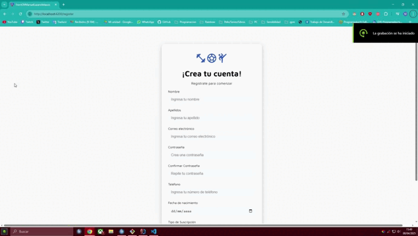
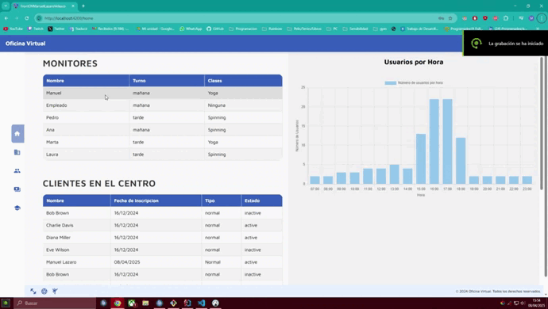

# 🏋️‍♂️ Oficina Virtual de Gestión Administrativa

Gestión completa para centros deportivos: usuarios, clases, pagos, entrenadores y más. Una solución moderna y eficaz para digitalizar la administración interna.

---

## 👨‍💻 Sobre el Autor

<table> <tr> <td align="center" width="140">  </td> <td> <strong>Manuel Lázaro Velasco</strong> <br> 🧑‍💻 Desarrollador de Aplicaciones Multiplataforma <br> 📍 Aranda de Duero, Burgos <br> 📧 <a href="mailto:manulazaro2000@gmail.com">manulazaro2000@gmail.com</a> <br> 🔗 <a href="https://www.linkedin.com/in/manuel-l%C3%A1zaro-velasco-5501a6232/">LinkedIn</a> </td> </tr> </table>

## 📌 Descripción

**Oficina Virtual** es una aplicación diseñada para facilitar la administración de centros deportivos como gimnasios. Permite gestionar:

- Usuarios y suscripciones
- Entrenadores y horarios
- Clases disponibles
- Pagos y facturación
- Gráficas dinámicas

> Proyecto Final de Desarrollo de Aplicaciones Multiplataforma (DAM)

---

## 🧠 Tecnologías utilizadas

| Frontend | Backend | Base de Datos |
|---------|---------|---------------|
| Angular, Node.js | Java, Spring Boot, Hibernate | MySQL |

- 🔐 Autenticación de usuarios
- 📅 Gestión de horarios con calendarios interactivos
- 💳 Control de pagos y suscripciones
- 📊 Panel de administración con estadísticas
- ⚙️ Graficas dinamicas con informacion de los usuarios

---
## 🎬 Demos de la Aplicación

### 👤 Vista del Usuario



---

### 👨‍💼 Vista del Empleado



---

## 📄 Documentación

- 📘 [Memoria del Proyecto](./Lazaro_Velasco_Manuel_Memoria_ProyectoFinal_DAM24.docx.pdf)
- 🧾 [Manual de Usuario](./Lazaro_Velasco_Manuel_Manual_ProyectoFinal_DAM24.docx.pdf)

---

## 🚀 Cómo ejecutar el proyecto

```bash
# Clona el repositorio
git clone https://github.com/ManuLazaro/oficina-virtual.git

# Backend
cd backend
./mvnw spring-boot:run

# Frontend
cd frontend
npm install
ng serve
